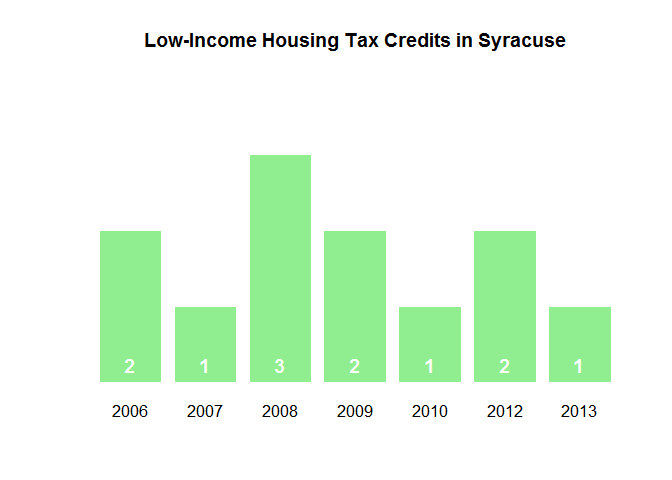
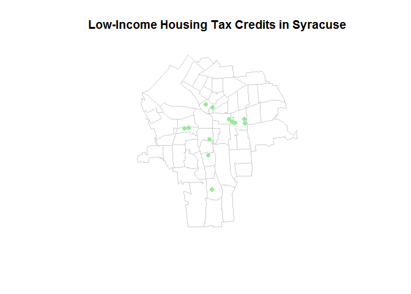

# Low-Income Housing Tax Credits


## What is the Low-Income Housing Tax credit (LIHTC)?

LIHTC helps create affordable housing by allowing state and local agencies the authority to issue tax credits to those who acquire and rehabilitate or construct rental housing for low-income househoulds. It is intended as an incentive to locate projects in low-income areas. 

## Raw data source

You can download the full national dataset for LIHTC from https://lihtc.huduser.gov/ in the form of a spreadsheet. A Data Dictionary explains each variable. The data has a row for each project ID and you can filter based on a variety of location variables and the year placed in service (Yr_PIS) or the allocation year (Yr_Alloc)

## 1. Load raw data for LIHTC from Github and select New Markets Tax Credits in Syracuse for the years 2005-2015

```r
# Load relevant libraries
library( maptools )
library( sp )
library( dplyr )
library( pander )
library( rgdal )
library(geojsonio)
```


```r
# Read in raw data with csv file
LIHTC.dat <- read.csv("https://raw.githubusercontent.com/lecy/SyracuseLandBank/master/DATA/RAW_DATA/LIHTC_raw.csv", header=TRUE)

# Select only the rows for Syracuse, NY
LIHTC.syr <- subset (LIHTC.dat, Proj_St == "NY" & Proj_Cty == "SYRACUSE")

# Select only the rows for years 2005-2015
LIHTC.syr.years <- subset (LIHTC.syr, Yr_Alloc >= 2005 & Yr_Alloc < 2016)
```

## 2. Aggregate LIHTC at the census tract level to create a new aggregated data set

```r
LIHTC.syr.years.filtered<- select(LIHTC.syr.years, FIPS2010, Yr_Alloc, Project)

LIHTC.ct.group<- group_by(LIHTC.syr.years.filtered, FIPS2010)

LIHTC.ct.group.counted <-count(LIHTC.ct.group, FIPS2010, Yr_Alloc)

LIHTC.data<-as.data.frame(LIHTC.ct.group.counted)

colnames(LIHTC.data) <- c("TRACT","YEAR","LIHTC")


LIHTC.ctdat<- LIHTC.data[complete.cases(LIHTC.data),]

LIHTC.ctdat
```

<div data-pagedtable="false">
  <script data-pagedtable-source type="application/json">
{"columns":[{"label":["TRACT"],"name":[1],"type":["dbl"],"align":["right"]},{"label":["YEAR"],"name":[2],"type":["int"],"align":["right"]},{"label":["LIHTC"],"name":[3],"type":["int"],"align":["right"]}],"data":[{"1":"36067001600","2":"2007","3":"1"},{"1":"36067002300","2":"2009","3":"1"},{"1":"36067003400","2":"2008","3":"1"},{"1":"36067003400","2":"2013","3":"1"},{"1":"36067003500","2":"2008","3":"1"},{"1":"36067003500","2":"2009","3":"1"},{"1":"36067003500","2":"2012","3":"1"},{"1":"36067004000","2":"2008","3":"1"},{"1":"36067004000","2":"2010","3":"1"},{"1":"36067004200","2":"2012","3":"1"},{"1":"36067005400","2":"2006","3":"1"},{"1":"36067006101","2":"2006","3":"1"}],"options":{"columns":{"min":{},"max":[10]},"rows":{"min":[10],"max":[10]},"pages":{}}}
  </script>
</div>

## 3. Data Visualization

### a. Low-Income Housing Tax Credits by Year


```r
# Count up tax credits by year
LIHTC.yrct<-count(LIHTC.ctdat, vars = YEAR)
LIHTC.bp<-as.data.frame(LIHTC.yrct)
LIHTC.bp<-LIHTC.bp[order(LIHTC.bp$vars),]

# Create a bar plot by year
barplot<-barplot(LIHTC.bp$n, names.arg=LIHTC.bp$vars, main="Low-Income Housing Tax Credits in Syracuse",  col= "lightgreen", border="white", ylim=c(0, 4), las=1, axes=F) 

text(x = barplot, y = 0,labels = LIHTC.bp$n, pos = 3, cex = 1.2, font = 2, col = "white")
```

<!-- -->


### b. Map location of Low-Income Housing Tax Credits in Syracuse


```r
# Read in census tract geojson file from Github

syr.ct <- geojson_read("https://raw.githubusercontent.com/lecy/SyracuseLandBank/master/SHAPEFILES/SYRCensusTracts.geojson", method="local", what="sp" )
```


```r
# Select latitude and longitude from LIHTC data
LIHTC.lat.long <- LIHTC.syr.years[,c("Longitude", "Latitude")]
LIHTC.lat.long.full <- LIHTC.lat.long[complete.cases(LIHTC.lat.long),]
lat.long.sp<-SpatialPoints(LIHTC.lat.long.full , proj4string=CRS("+proj=longlat +datum=WGS84"))

# Plot points on Syracuse map
plot(syr.ct, border="gray80", main="Low-Income Housing Tax Credits in Syracuse")
points(lat.long.sp, col="lightgreen", pch=19, cex=1)
```

<!-- -->

## 4. Save the new aggregated data set on to Github as a CSV file

```r
# Generate a .CSV file 
setwd( "../../DATA/AGGREGATED_DATA" )
write.csv( LIHTC.ctdat, "LIHTC_aggregated.csv", row.names=F )
```


