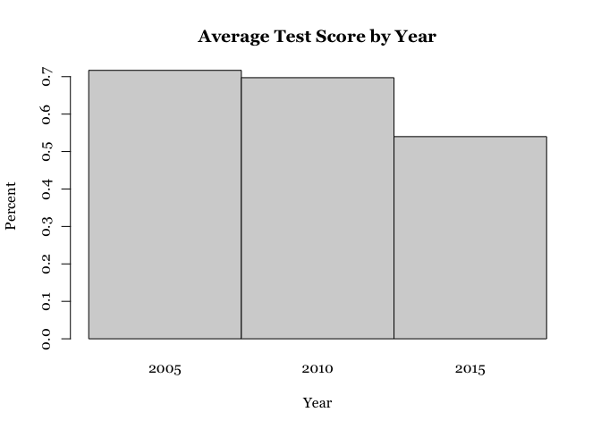
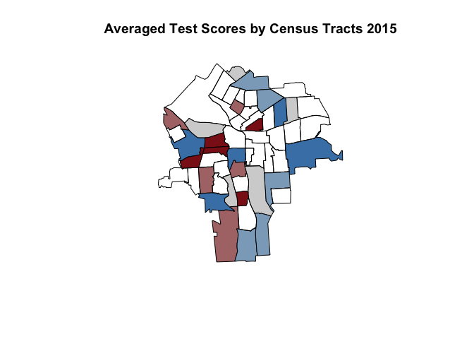
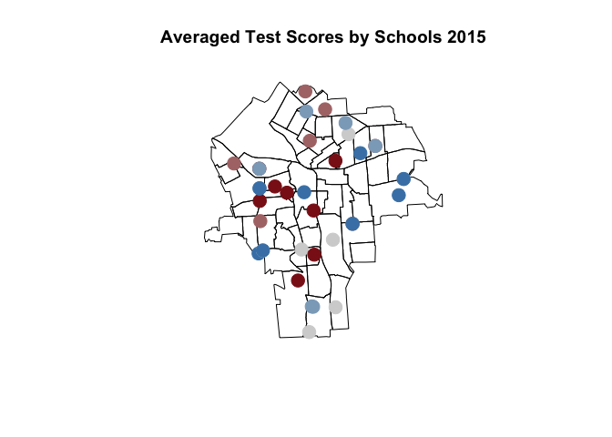

Syracuse Schools
================
April 20, 2017

School Quality and Housing Values
=================================

School quality and nearby housing values are inherently linked. While the direction of the causual relationship is unclear (whether changes school quality causes changes in housing or vice versa), there is certainly a strong correlation between school quality and nearby housing values. This dataset of test averages from Syracuse City School District for years 2005, 2010, and 2015 allows us to begin exploring this relationship in the Syracuse area.

Dataset
=======

This dataset was provided by the Syracuse School District and contains the following information for 2005, 2010 and 2015:

Year, School Name, Test Type (ELA, MATH, Science, Social Studies and Various NY State Regents Tests), and Average Test Score. ELA and Math Score are out of 800 points and the other test types are out of 100 points.

The below code will first standardize all test scores to a 0-100 percent scale. Then the data will be wrangled by averaging all averaged tests scores across schools for 2005, 2010, 2015. This will produce an average test score per school per year. Then, the averaged score for an individual school is averaged with a school in the same census to produce an averaged score for each census tract for years 2005, 2010 and 2015.

In addition to the above wrangling, all schools are geocoded and then spatial joined with Syracuse census tract files so school test scores can be analyzed and mapped at the census tract level.

Lastly, some descriptive statistics, mapping and graphs are provided below the data wrangling.

1. Read in Syracuse school test data for 2005, 2010, 2015.
==========================================================

``` r
#setwd("/Users/beelerenator/Documents/Graduate School/MPA Syracuse/DDMII/Project/SyracuseCityPublicSchools")

#load in data from school district with test scores
#school.tests <- read.csv("schooldata2005_2010_2015.csv", stringsAsFactors=FALSE )

my.url <- "https://raw.githubusercontent.com/christine-brown/SyracuseLandBank/master/DATA/RAW_DATA/schooldata2005_2010_2015.csv"
school.tests <- read.csv(my.url, stringsAsFactors=FALSE )
school.tests <- na.omit(school.tests)
```

2. Clean Data
=============

Take out non-schools from school variable & Make binary variable if school is open or closed

``` r
#clean data -- take out non-schools from school variable
school.tests <- filter(school.tests, Accountability.School != "24" & Accountability.School != "34" & Accountability.School != "40", Accountability.School != "9", Accountability.School != "28", Accountability.School != "363", Accountability.School != "GED 16-17", Accountability.School != "GED 18+", Accountability.School != "3" )

#make binary variable if school is open or closed 
open.schools <- school.tests$Accountability.School!="Elmwood Elementary School - CLOSED" & school.tests$Accountability.School!="Levy Middle School - CLOSED" &
 school.tests$Accountability.School!="Bellevue Middle School Academy at Shea- CLOSED" & school.tests$Accountability.School!="Blodgett Middle School - CLOSED" & school.tests$Accountability.School!="Westside Academy @ Blodgett Elementary- CLOSED"
open.schools <- data.frame(open.schools)
school.tests <- cbind(school.tests, open.schools)
```

3. Geocode schools and then export csv and then re-import it from Github
========================================================================

Add the latitude and longitude back to the school test dataset

``` r
#Geocode schools
#addresses.to.geocode <- paste( school.tests$Accountability.School, "Syracuse, NY", sep=", " )
#school.lat.long <- geocode( addresses.to.geocode )
#Save lat.long list to .csv file 
#write.csv(school.lat.long, file = "school.lat.lon.csv")

url2 <- "https://raw.githubusercontent.com/christine-brown/SyracuseLandBank/master/DATA/RAW_DATA/syracuse_school.lat.lon.csv"
school.lat.long <- read.csv(url2, stringsAsFactors=FALSE )

#school.lat.long <- read.csv("syracuse_school.lat.lon.csv")
school.lat.long <- school.lat.long[ c("lon","lat")]

#add lat.long list to school dataframe
school.tests <- cbind(school.tests, school.lat.long)
```

4. Standardize the test scores across all schools:
==================================================

    ELA and Math tests are out of 800. All of the other test types are out of 100

``` r
#standardizing all test score to percents
school.tests$percent.score <- ifelse(school.tests$Test_Code=="ELA" | school.tests$Test_Code=="MATH", (school.tests$mean/800), school.tests$mean/100)
```

5. Wrangle Data so that all test scores are averaged for each school in 2005, 2010, 2015
========================================================================================

``` r
#average test score for a given school in a given year
school.tests.grouped <- group_by(school.tests, Test.Year, Accountability.School)
school.test.avgd <- summarise(school.tests.grouped, 
Score=mean(percent.score),
lon=unique(lon),
lat=unique(lat),
school.open=unique(open.schools))
school.test.avgd <- data.frame(school.test.avgd)
```

6. Read in Syracuse Census Map Data
===================================

Transform latitude and longitude points intow spatial points Join latitude and longitude points with census spatial data

``` r
#load in census tracts
#census.onondaga  <- readShapePoly( fn="tl_2010_36067_tract10", proj4string=CRS("+proj=longlat +datum=WGS84") )
#plot(census.syr)
census.syr <- geojson_read("https://raw.githubusercontent.com/christine-brown/SyracuseLandBank/master/SHAPEFILES/SYRCensusTracts.geojson", method="local", what="sp")

census.syr <- spTransform( census.syr, CRS( "+proj=longlat +datum=WGS84")) 


#census.syr <- census.onondaga[as.numeric(as.character(census.onondaga$NAME10)) < 62, ]

#turn shapefile into data frame
dat.census.syr <- data.frame(census.syr)

#turn lat.long into spatial points and match it with onongoda map

school.lat.long2 <- dplyr::select(school.test.avgd, lon, lat)
school.lat.long2 <- SpatialPoints(school.lat.long2, proj4string=CRS("+proj=longlat +datum=WGS84") )

census.matched.to.points <- over(school.lat.long2, census.syr )

#bind census tracts to schools
school.w.census <- cbind( school.test.avgd, census.matched.to.points)

#maximum latitude and longitude to zoom in on 'cuse
#x.min1 <- min(school.lat.long2$lon)
#x.max1 <- max(school.lat.long2$lon)

#y.min1 <- min(school.lat.long2$lat)
#y.max1 <- max(school.lat.long2$lat)

#graph syracuse schools over census tracts
#plot(census.syr, 
#xlim=c(x.min1, x.max1), 
#ylim=c(y.min1, y.max1))
#points(school.lat.long2, pch=20, cex=1, col="red")
```

7. -Wrangle Data so that there is an average score per census tract per year.
=============================================================================

Rename variable names for merge with other datasets Write csv of processed data set to be uploaded to github

``` r
#average school averaged test score across census tracts across years

school.w.census.grouped <- group_by(school.w.census, Test.Year, TRACTCE10)
census.score.year <- summarise(school.w.census.grouped, 
Avg.Score=mean(Score),
STATEFP10=unique(STATEFP10), 
COUNTYFP10=unique(COUNTYFP10), 
GEOID10=unique(GEOID10), 
NAME10=unique(NAME10), 
NAMELSAD10=unique(NAMELSAD10), 
MTFCC10=unique(MTFCC10), 
FUNCSTAT10=unique(FUNCSTAT10), 
ALAND10=unique(ALAND10), 
AWATER10=unique(AWATER10), 
INTPTLAT10=unique(INTPTLAT10), 
INTPTLON10=unique(INTPTLON10))

#rename variable "Year" name for merge with other datasets
#census.score.year <- plyr::rename(census.score.year, c("Test.Year"="Year"))

#write csv to be uploaded to github
#write.csv(census.score.year, file = "syr__ed_score_per_tract.csv")
```

Descriptive Statistics, Plots and Maps to follow:
-------------------------------------------------

Bar Graph Showing Test Performance for all Schools Between 2015, 2010, 2005

``` r
#bar graphs for all school data points
allschool.data.2015 <- filter(school.tests, Test.Year == 2015)
allschool.data.2010 <- filter(school.tests, Test.Year == 2010)
allschool.data.2005 <- filter(school.tests, Test.Year == 2005)

Group.allschool.test <-group_by(school.tests, Test.Year)
Avg.scoretests <- summarise(Group.allschool.test, Avg.score=mean(percent.score, na.rm=T))

par(mar=c(5,4,4,2) +.1)
par(family="Georgia")
barplot(Avg.scoretests$Avg.score, 
        main="Average Test Score by Year", 
    xlab="Year", ylab = "Percent", 
    names.arg=Avg.scoretests$Test.Year, 
    col= c("steelblue", "light gray", "firebrick4")
)
```



Map of Syracuse Averaged School Scores by Census Tracts 2015

``` r
ed.data.2015 <- filter(census.score.year, Test.Year == 2015)
ed.data.2010 <- filter(census.score.year, Test.Year == 2010)
ed.data.2005 <- filter(census.score.year, Test.Year == 2005)


#map of 2015 schools by census tract
color.function <- colorRampPalette( c("firebrick4","light gray","steel blue" ) )

col.ramp <- color.function( 5 ) # number of groups you desire

color.vector <- cut( rank(ed.data.2015$Avg.Score), breaks=5, labels=col.ramp )

color.vector <- as.character( color.vector )

this.order <- match( dat.census.syr$TRACTCE10, ed.data.2015$TRACTCE10 )

color.vec.ordered <- color.vector[ this.order ]

plot(census.syr, col=color.vec.ordered, main="Averaged Test Scores by Census Tracts 2015")
```



``` r
#Fix Legend
#map.scale( metric=F, ratio=F, relwidth = 0.15, cex=0.5 )
#legend.text=c(" $8,943-$30,560"," $31,353-$46,458"," $48,611-$62,708","$63,013-$75,357","$75,702-$125,724")
#legend( "bottomright", bg="white",
 #       pch=19, pt.cex=1.5, cex=0.7,
  #      legend=legend.text, 
   #     col=col.ramp, 
    #    box.col="white",
     #   title="Median Family Income" 
  #     )
```

Syracuse Schools Color-Coded By Averaged School Score for 2015

``` r
#schools for 2015 
school.data.2015 <- filter(school.w.census, Test.Year == 2015)

color.function <- colorRampPalette( c("firebrick4","light gray","steel blue" ) )

col.ramp.sc <- color.function( 5 ) # number of groups you desire

color.vector.sc <- cut( rank(school.data.2015$Score), breaks=5, labels=col.ramp.sc )

color.vector.sc <- as.character( color.vector.sc )

#this.order <- match( dat.census.syr$TRACTCE10, ed.data.2015$TRACTCE10 )
#color.vec.ordered <- color.vector[ this.order ]

plot(census.syr, main="Averaged Test Scores by Schools 2015")
points(school.data.2015$lon, school.data.2015$lat, col=color.vector.sc, pch=20, cex=3)
```



``` r
#fix legend
#map.scale( metric=F, ratio=F, relwidth = 0.15, cex=0.5 )
#legend.text=c(" $8,943-$30,560"," $31,353-$46,458"," $48,611-$62,708","$63,013-$75,357","$75,702-$125,724")
#legend( "bottomright", bg="white",
 #       pch=19, pt.cex=1.5, cex=0.7,
  #      legend=legend.text, 
   #     col=col.ramp, 
    #    box.col="white",
     #   title="Median Family Income" 
      # )
```
