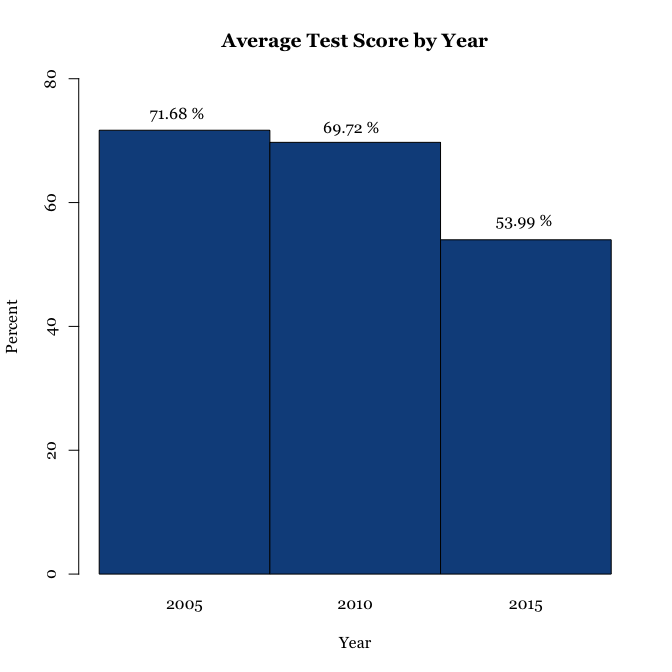
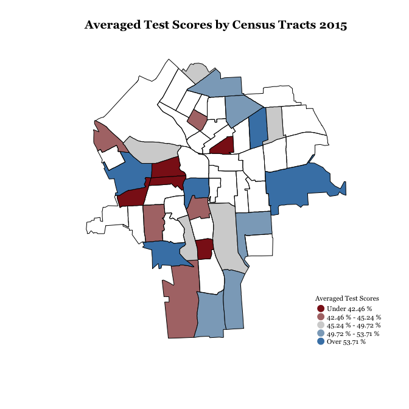
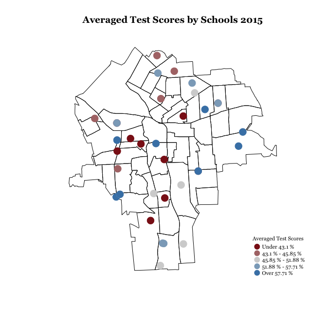
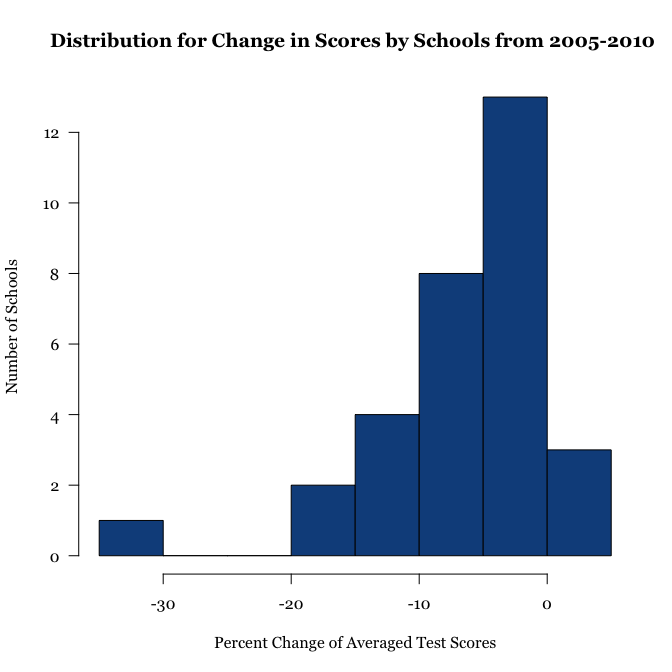
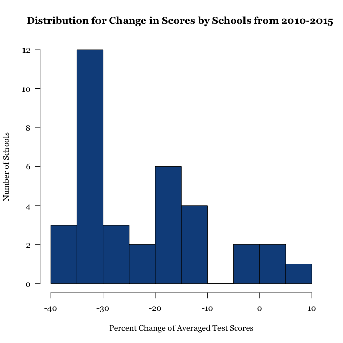
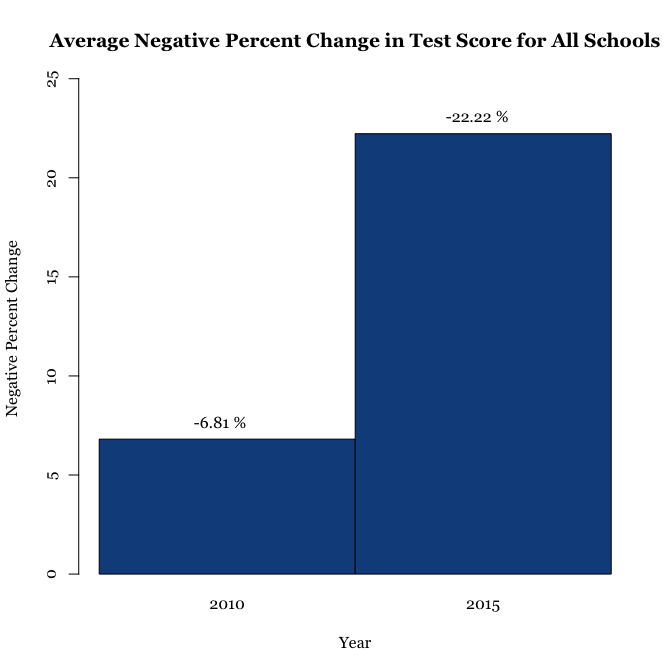

# Syracuse Schools & Housing Values


#Introduction
School quality and nearby housing values are inherently linked. While the direction of the causual relationship is unclear (whether changes school quality causes changes in housing or vice versa), there is certainly a strong correlation between school quality and nearby housing values. This dataset of test averages from Syracuse City School District for years 2005, 2010, and 2015 allows us to begin exploring this relationship in the Syracuse area.

#Dataset Wranging

##Details on Dataset
This dataset was provided by the Syracuse School District and contains the following information for 2005, 2010 and 2015: 

  1. Year, School Name, Test Type (ELA, MATH, Science, Social Studies and Various NY State     Regents Tests), and Average Test Score. ELA and Math Score are out of 800 points and the     other test types are out of 100 points.

  2. The below code will first standardize all test scores to a 0-100 percent scale. Then the   data will be wrangled by averaging all averaged tests scores across schools for 2005, 2010,   2015. This will produce an average test score per school per year. Then, the averaged score   for an individual school is averaged with a school in the same census to produce an          averaged score for each census tract for years 2005, 2010 and 2015.  

  3. In addition to the above wrangling, all schools are geocoded and then spatial joined      with Syracuse census tract files so school test scores can be analyzed and mapped at the     census tract level.

  4. Lastly, some descriptive statistics, mapping and graphs are provided below the data       wrangling.

##Read in School Test Data for 2005, 2010, 2015 

```r
#load in data from school district with test scores

setwd("/Users/beelerenator/Documents/Graduate School/MPA Syracuse/DDMII/DDMII Project/BUILD/Schools")

setwd("..")
setwd("..")
setwd("./DATA/RAW_DATA")
school.tests <- read.csv( "schooldata2005_2010_2015.csv", stringsAsFactors=FALSE )
school.tests <- na.omit(school.tests)
```
## Clean Data 
Take out non-schools from school variable & Make binary variable if school is open or closed
           
           

```r
#clean data -- take out non-schools from school variable
school.tests <- filter(school.tests, Accountability.School != "24" & Accountability.School != "34" & Accountability.School != "40", Accountability.School != "9", Accountability.School != "28", Accountability.School != "363", Accountability.School != "GED 16-17", Accountability.School != "GED 18+", Accountability.School != "3" )

#make binary variable if school is open or closed 
open.schools <- school.tests$Accountability.School!="Elmwood Elementary School - CLOSED" & school.tests$Accountability.School!="Levy Middle School - CLOSED" &
 school.tests$Accountability.School!="Bellevue Middle School Academy at Shea- CLOSED" & school.tests$Accountability.School!="Blodgett Middle School - CLOSED" & school.tests$Accountability.School!="Westside Academy @ Blodgett Elementary- CLOSED"
open.schools <- data.frame(open.schools)
school.tests <- cbind(school.tests, open.schools)
```

##Geocode schools 
After Geocoding Schools:

  1. The data will then be exported csv
  2. Then it will be re-imported it from Github 
  3. Then add the latitude and longitude back to the above school test dataset


```r
#Geocode schools
#addresses.to.geocode <- paste( school.tests$Accountability.School, "Syracuse, NY", sep=", " )
#school.lat.long <- geocode( addresses.to.geocode )
#Save lat.long list to .csv file 
#write.csv(school.lat.long, file = "school.lat.lon.csv")

setwd("..")
setwd("..")
setwd("./DATA/RAW_DATA")
school.lat.long <- read.csv("syracuse_school.lat.lon.csv", stringsAsFactors=FALSE )

school.lat.long <- school.lat.long[ c("lon","lat")]

#add lat.long list to school dataframe
school.tests <- cbind(school.tests, school.lat.long)
```

##Standardize Test Scores 


    

```r
#standardizing all test score to percents across all schools
#ELA and Math tests are out of 800. All of the other test types are out of 100

school.tests$percent.score <- ifelse(school.tests$Test_Code=="ELA" | school.tests$Test_Code=="MATH", (school.tests$mean/800), school.tests$mean/100)
```

##Wrangle Data Pt. 1
  
  All test scores are averaged for each school in 2005, 2010, 2015


```r
#average test score for a given school in a given year
school.tests.grouped <- group_by(school.tests, Test.Year, Accountability.School)
school.test.avgd <- summarise(school.tests.grouped, 
Score=mean(percent.score),
lon=unique(lon),
lat=unique(lat),
school.open=unique(open.schools))
school.test.avgd <- data.frame(school.test.avgd)
```

##Read in Syracuse Census Map Data
 
 1. Transform latitude and longitude points intow spatial points
 2. Join latitude and longitude points with census spatial data
 3. Write CSV file for Desaggreagated school test score data


```r
#load in census tracts

setwd("..")
setwd("..")
setwd("./SHAPEFILES")


census.syr <- geojson_read("SYRCensusTracts.geojson", method="local", what="sp")

census.syr <- spTransform(census.syr, CRS( "+proj=longlat +datum=WGS84")) 

#turn shapefile into data frame
dat.census.syr <- data.frame(census.syr)

#turn lat.long into spatial points and match it with onongoda map

school.lat.long2 <- dplyr::select(school.test.avgd, lon, lat)
school.lat.long2 <- SpatialPoints(school.lat.long2, proj4string=CRS("+proj=longlat +datum=WGS84") )

census.matched.to.points <- over(school.lat.long2, census.syr )

#bind census tracts to schools
school.w.census <- cbind( school.test.avgd, census.matched.to.points)
school.w.census <- na.omit(school.w.census)

#write csv for school point desgregated data 

#setwd("..")

setwd("..")
setwd("./DATA/PROCESSED_DATA")
write.csv(school.w.census, file = "schools_processed.csv")
```

##Wrangle Data Pt. 2

 Wrangle so that there is an average score per census tract per year. 
  
  1. Rename variable names for merge with other datasets
  2. Write csv of processed data set to be uploaded to github


```r
#average school averaged test score across census tracts across years

school.w.census.grouped <- group_by(school.w.census, Test.Year, TRACTCE10)
census.score.year <- summarise(school.w.census.grouped, 
Avg.Score=mean(Score),
STATEFP10=unique(STATEFP10), 
COUNTYFP10=unique(COUNTYFP10), 
GEOID10=unique(GEOID10), 
NAME10=unique(NAME10), 
NAMELSAD10=unique(NAMELSAD10), 
MTFCC10=unique(MTFCC10), 
FUNCSTAT10=unique(FUNCSTAT10), 
ALAND10=unique(ALAND10), 
AWATER10=unique(AWATER10), 
INTPTLAT10=unique(INTPTLAT10), 
INTPTLON10=unique(INTPTLON10))

# Subset for merge and rename variables for merge   #GEOID keep and rename TRACT
census.score.year.subset <- dplyr::select(census.score.year, Test.Year, GEOID10, Avg.Score)
census.score.year.subset <- plyr::rename(census.score.year.subset, c("Test.Year"="YEAR", "GEOID10" = "TRACT", "Avg.Score" = "SCHOOL_SCORE"))

#write csv to be uploaded to github

setwd("..")
setwd("..")
setwd("./DATA/AGGREGATED_DATA")
write.csv(census.score.year.subset, file = "schools_aggregated.csv")
```

#Descriptive Statistics 

##Bar Graph 1 

  Showing Test Performance for all Schools Between 2015, 2010, 2005


```r
#bar graphs for all school data points
allschool.data.2015 <- filter(school.tests, Test.Year == 2015)
allschool.data.2010 <- filter(school.tests, Test.Year == 2010)
allschool.data.2005 <- filter(school.tests, Test.Year == 2005)

Group.allschool.test <-group_by(school.tests, Test.Year)
Avg.scoretests <- summarise(Group.allschool.test, Avg.score=mean(percent.score, na.rm=T))
Avg.scoretests$Avg.score <- Avg.scoretests$Avg.score*100

par(family="Georgia")
barplot(Avg.scoretests$Avg.score, 
        main="Average Test Score by Year", 
  	xlab="Year", ylab = "Percent", 
  	names.arg=Avg.scoretests$Test.Year, space=0,
  	col= c("dodgerblue4", "dodgerblue4", "dodgerblue4"), ylim=c(0,80)
)
text(0.4574257,74.19680, "71.68 %")
text(1.4781278,71.95029, "69.72 %")
text(2.4907291,56.97356, "53.99 %")
```

<!-- -->


##Map by Census 2015 

  Averaged School Scores by Census Tracts 2015


```r
ed.data.2015 <- filter(census.score.year, Test.Year == 2015)
ed.data.2010 <- filter(census.score.year, Test.Year == 2010)
ed.data.2005 <- filter(census.score.year, Test.Year == 2005)

#map of 2015 schools by census tract
color.function <- colorRampPalette( c("firebrick4","light gray","steel blue" ) )

col.ramp <- color.function( 5 ) # number of groups you desire

color.vector <- cut( rank(ed.data.2015$Avg.Score), breaks=5, labels=col.ramp )

color.vector <- as.character( color.vector )

this.order <- match( dat.census.syr$TRACTCE10, ed.data.2015$TRACTCE10 )

color.vec.ordered <- color.vector[ this.order ]

par(family="Georgia")
plot(census.syr, col=color.vec.ordered, main="Averaged Test Scores by Census Tracts 2015")

breaks.Score2015 <-classIntervals(ed.data.2015$Avg.Score, n=5, style="quantile")
breaks.Score2015$brks <- breaks.Score2015$brks*100
breaks.Score2015$brks <- round(breaks.Score2015$brks, 2)
breaks.Score2015$brks <- paste(breaks.Score2015$brks,"%")


legend( "bottomright", bg="white",
        pch=19, pt.cex=1.5, cex=0.7,
        legend=capitalize(leglabs(breaks.Score2015$brks)), 
        col=col.ramp, 
        box.col="white",
        title="Averaged Test Scores", title.adj = .1, xjust=1
           )
```

<!-- -->

##Map by Schools 2015 

  Syracuse Schools Color-Coded By Averaged School Score for 2015  


```r
#schools for 2015 
school.data.2015 <- filter(school.w.census, Test.Year == 2015)

color.function <- colorRampPalette( c("firebrick4","light gray","steel blue" ) )

col.ramp.sc <- color.function( 5 ) # number of groups you desire

color.vector.sc <- cut( rank(school.data.2015$Score), breaks=5, labels=col.ramp.sc )

color.vector.sc <- as.character( color.vector.sc )

#this.order <- match( dat.census.syr$TRACTCE10, ed.data.2015$TRACTCE10 )
#color.vec.ordered <- color.vector[ this.order ]

par(family="Georgia")
plot(census.syr, main="Averaged Test Scores by Schools 2015")
points(school.data.2015$lon, school.data.2015$lat, col=color.vector.sc, pch=20, cex=3)

breaks.Sch.score2015 <-classIntervals(school.data.2015$Score, n=5, style="quantile")
breaks.Sch.score2015$brks <- breaks.Sch.score2015$brks*100
breaks.Sch.score2015$brks <- round(breaks.Sch.score2015$brks, 2)
breaks.Sch.score2015$brks <- paste(breaks.Sch.score2015$brks,"%")

legend( "bottomright", bg="white",
        pch=19, pt.cex=1.5, cex=0.7,
        legend=capitalize(leglabs(breaks.Sch.score2015$brks)), 
        col=col.ramp.sc, 
        box.col="white",
        title="Averaged Test Scores", title.adj = .1, xjust=1
           )
```

<!-- -->

##Histrogram 1

  Distribution for Change in Test Scores by Schools from 2005-2010 


```r
school.w.census.grp <- group_by(school.w.census, Accountability.School)

school.diffs <- mutate(school.w.census.grp, Score_Diff = c(0, diff(Score)))

school.diffs.2010 <- filter(school.diffs, Test.Year == 2010 & Score_Diff != 0)
school.diffs.2010$Score_Diff <- school.diffs.2010$Score_Diff*100

par(family="Georgia") 
hist(school.diffs.2010$Score_Diff, 
     main="Distribution for Change in Test Scores by Schools from 2005-2010 ", 
     xlab="Percent Change of Averaged Test Scores", ylab="Number of Schools", 
     col="dodgerblue4", 
     las=1)
```

<!-- -->

##Histogram 2

Distribution for Change in Test Scores by Schools from 2010-2015  


```r
school.diffs.2015 <- filter(school.diffs, Test.Year == 2015 & Score_Diff != 0)
school.diffs.2015$Score_Diff <- school.diffs.2015$Score_Diff*100

par(family="Georgia") 
hist(school.diffs.2015$Score_Diff, 
     main="Distribution for Change in Test Scores by Schools from 2010-2015 ", 
     xlab="Percent Change of Averaged Test Scores", ylab="Number of Schools", 
     col="dodgerblue4",
     las=1)
```

<!-- -->

##Bar Graph 2

  Average Negative Percent Change in Test Score for All Schools


```r
school.diffs.2010.15 <- filter(school.diffs, Test.Year != 2005 & Score_Diff != 0)

Group.school.diffs.2010.15 <-group_by(school.diffs.2010.15 , Test.Year)
Avg.score.diff.schools <- summarise(Group.school.diffs.2010.15, Avg.Score_Diff=mean(Score_Diff, na.rm=T))
Avg.score.diff.schools$Avg.Score_Diff <-lapply(Avg.score.diff.schools$Avg.Score_Diff, abs)
Avg.score.diff.schools$Avg.Score_Diff <- as.numeric(Avg.score.diff.schools$Avg.Score_Diff)
Avg.score.diff.schools$Avg.Score_Diff <- Avg.score.diff.schools$Avg.Score_Diff*100

par(family="Georgia")
barplot(Avg.score.diff.schools$Avg.Score_Diff, 
        main="Average Negative Percent Change in Test Score for All Schools", 
  	xlab="Year", ylab = "Negative Percent Change ", 
  	names.arg=Avg.score.diff.schools$Test.Year, space=0, ylim=c(0, 25),
  	col= c("dodgerblue4", "dodgerblue4")
)
text(0.4723672,7.681059, "-6.81 %")
text(1.476868, 23.120831, "-22.22 %")
```

<!-- -->

##Map of School Change
Prepare Map of Schools by Change in Test Scores from 2010-2015


```r
color.function <- colorRampPalette( c("firebrick4","light gray","steelblue" ) )

col.ramp.school.diff15 <- color.function( 5 ) # number of groups you desire

color.vector.school.diff15 <- cut( rank(school.diffs.2015$Score_Diff), breaks=5, labels=col.ramp.school.diff15 )

color.vector.school.diff15 <- as.character( color.vector.school.diff15 )

breaks.Score.diff2015 <-classIntervals(school.diffs.2015$Score_Diff, n=5, style="quantile")
breaks.Score.diff2015$brks <- round(breaks.Score.diff2015$brks, 2)
breaks.Score.diff2015$brks <- paste(breaks.Score.diff2015$brks,"%")
```

Prepare Map of Schools by Change in Test Scores from 2005-2010


```r
color.function <- colorRampPalette( c("firebrick4","light gray","steelblue" ) )

col.ramp.school.diff10 <- color.function( 5 ) # number of groups you desire

color.vector.school.diff10 <- cut( rank(school.diffs.2010$Score_Diff), breaks=5, labels=col.ramp.school.diff10 )

color.vector.school.diff10 <- as.character( color.vector.school.diff10 )

breaks.Score.diff2010 <-classIntervals(school.diffs.2010$Score_Diff, n=5, style="quantile")
breaks.Score.diff2010$brks <- round(breaks.Score.diff2010$brks, 2)
breaks.Score.diff2010$brks <- paste(breaks.Score.diff2010$brks,"%")
```

GIF for Change in Averaged Test Scores by School from 2005-2010 & 2010-2015


```r
saveGIF({

{
  
par(family="Georgia") 
  plot(census.syr, main="Change in Averaged Test Scores by School from 2005 to 2010")
points(school.diffs.2010$lon, school.diffs.2010$lat, col=color.vector.school.diff10, pch=20, cex=3)

legend( "bottomright", bg="white",
        pch=19, pt.cex=1.5, cex=0.7,
        legend=capitalize(leglabs(breaks.Score.diff2010$brks)), 
        col=col.ramp.school.diff10, 
        box.col="white",
        title="Change in Test Scores", title.adj = .1, xjust=1
           )

par(family="Georgia")
plot(census.syr, main="Change in Averaged Test Scores by School from 2010 to 2015")
points(school.diffs.2015$lon, school.diffs.2015$lat, col=color.vector.school.diff15, pch=20, cex=3)

legend( "bottomright", bg="white",
        pch=19, pt.cex=1.5, cex=0.7,
        legend=capitalize(leglabs(breaks.Score.diff2015$brks)), 
        col=col.ramp.school.diff15, 
        box.col="white",
        title="Change in Test Scores", title.adj = .1, xjust=1
           )

  
  
  }


}, 

movie.name = "movie_name3.gif",   # name of your gif
interval = 1.5,                  # controls the animation speed
ani.width = 800,                 # size of the gif in pixels
ani.height = 800 )               # size of the git in pixels
```

```
## [1] TRUE
```


