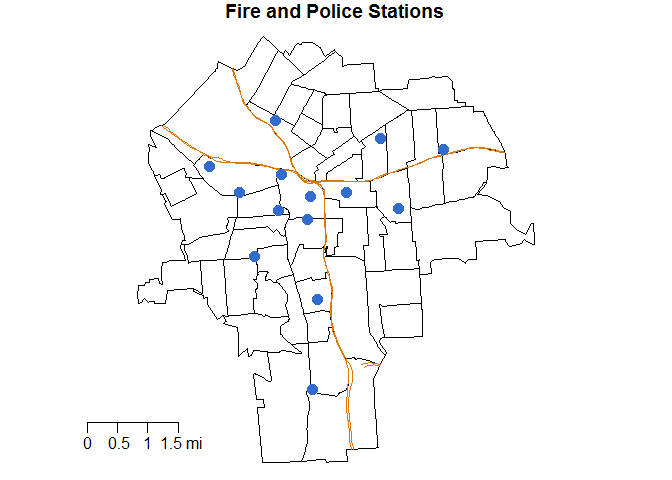

# Fire and Police Stations


### Data Acquisition and Preparation
This section of the project draws on the parcel spatial data set. The data set includes a land use variable that has a category for "Police and Fire Protection, Electrical Signal." Once acquired, it must be cleaned and aggregated in order to be included in the analysis of all variables collected for this project. 

```r
#Load Packages
library( dplyr )
library( geojsonio )
library( ggmap )
library( maps )
library( maptools )
library( raster )
library( rgdal )
library( rgeos )
library( sp )

#Load Shapefiles
syr_tracts <- geojson_read( "../../SHAPEFILES/SYRCensusTracts.geojson" , method = "local" , what = "sp" )
syr_tracts <- spTransform( syr_tracts , CRS( "+proj=longlat +datum=WGS84" ) )
syr_parcels <- geojson_read( "../../SHAPEFILES/syr_parcels.geojson" , method = "local" , what = "sp" )
syr_parcels <- spTransform( syr_parcels , CRS( "+proj=longlat +datum=WGS84" ) )

#Create a variable for the FIPS code
syr_parcels$TRACT <- as.numeric( as.character( syr_parcels$CensusTrac ) )
syr_parcels <- syr_parcels[ !is.na( syr_parcels$TRACT ), ]
syr_parcels$TRACT <- as.character( syr_parcels$TRACT*100 )
flag <- nchar( syr_parcels$TRACT ) == 3
syr_parcels$TRACT[ flag ] <- paste0( "0" , syr_parcels$TRACT[ flag ] )
syr_parcels$TRACT <- paste( "3606700" , syr_parcels$TRACT , sep = "" )

#Identify fire and police parcels and add coordinates
firepolice_sp <- syr_parcels[ syr_parcels$LUCODE == 662 , ]
firepolice_centroid <- gCentroid( firepolice_sp , byid = TRUE )
firepolice <- cbind( as.data.frame( firepolice_sp ), as.data.frame( firepolice_centroid ) )
firepolice <- firepolice[ , c( "TRACT" , "x" , "y" ) ]
names( firepolice ) <- c( "TRACT" , "LON" , "LAT" )

#Export processed data to a CSV file
write.csv( firepolice , file = "../../DATA/PROCESSED_DATA/firepolice_processed.csv" , row.names = F )

#Aggregate the data at the tract level
firepolice_tract <- as.data.frame( table( firepolice$TRACT ) )
firepolice_tract$YEAR <- 2017
names( firepolice_tract ) <- c( "TRACT" , "FIREPOLICE" , "YEAR" )

#Export aggregated date to a CSV file
write.csv( firepolice_tract , file = "../../DATA/AGGREGATED_DATA/firepolice_aggregated.csv" , row.names = F )
```

### Data Visualization
The visualization below shows the location of the Syracuse police and fire stations represented by blue dots.  The interstates are included for spatial context.

```r
#Load road data
roads <- geojson_read( "../../SHAPEFILES/roads.geojson" , method = "local" , what = "sp" )
roads <- spTransform( roads , CRS( "+proj=longlat +datum=WGS84" ) )

#Subset the interstates
interstate <- roads[ roads$RTTYP == "I" , ]

#Clip the interstates to the Syracuse border
syr_outline <- gBuffer( syr_tracts , width = .000 , byid = F )
interstate_clipped <- gIntersection( syr_outline , interstate , byid = TRUE , drop_lower_td = TRUE)

#Plot the visualization
par( mar = c( 0 , 0 , 1 , 0 ) )
plot( syr_tracts , main = "Fire and Police Stations" )
plot( interstate_clipped , col = "#dd7804" , lwd = 1.75 , add = T )
points( firepolice_centroid , pch = 19 , col = "#316dce" , cex = 1.5 )
map.scale( x = -76.22 , y = 42.994 , metric = F , ratio = F , relwidth = 0.1 , cex = 1 )
```

<!-- -->
