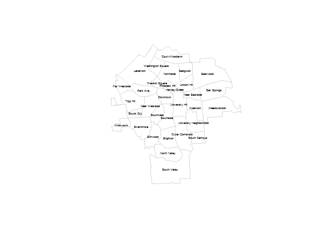
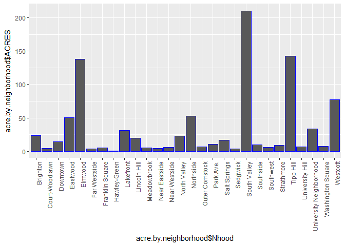

# Parks


### Data Acquisition and Preparation

Syracuse University's Geography Department has the data of public space and parks. After having the data, it should be cleaned, geocoded, and aggregated in order to be included in the analysis of all variables collected for this project. 


```r
#Load Packages
library( dplyr )
library( geojsonio )
library( ggmap )
library( maps )
library( maptools )
library( raster )
library( rgdal )
library( rgeos )
library( sp )
library( geojsonio )


#Get parks data from Community Geography
setwd("..")
setwd("..")
setwd("./DATA/RAW_DATA")

# dir.create( "park_shape" )
# download.file( "http://communitygeography.org/wp-content/uploads/2015/09/SyracuseParks051414_UTM.zip" , "park_shape/park.zip" )
# unzip( "park_shape/park.zip" , exdir = "park_shape" )
# 
# #Change original data into shapefile and convert to CSV
# park <- readShapePoly( fn = "park_shape/SyracuseParks051414_UTM" , proj4string = CRS( "+proj=longlat +datum=WGS84" ) )
# park <- as.data.frame( park , stringsAsFactors = FALSE )
# 
# #Delete Community Geography file because CSV has all information
# unlink( "park_shape" , recursive = TRUE )
# 
# #Write data as a CSV for future access
# write.csv( park, file = "../../DATA/RAW_DATA/park_raw.csv" , row.names = FALSE )

park <- read.csv("../../DATA/RAW_DATA/park_raw.csv")

url <- "https://raw.githubusercontent.com/lecy/SyracuseLandBank/master/SHAPEFILES/syr_neighborhoods.geojson"
syr <- geojson_read( url, method="local", what="sp" )

plot( syr, border="light gray" )
text( getSpPPolygonsLabptSlots(syr), labels=syr$NAME, cex=0.4 )
```

<!-- -->

Different parks have different affects for the community and the condition of the community also decide whether the park will increase property value or decrease by itself. 
So the following descriptive data will show park type and Nhood. This should test with community trends in crime(which is not availbale now) and poverty.
Possible model could be NB, KSVM, SVM, lm. Using 2/3 data as train data and 1/3 for test data.


```r
#Clean data

#check colnames and select useful ones
park.select <- park[, c(1:20,29,55:57) ]

#descriptive analysis

#types of park
type.table <- table(park.select$Park_Type)
type.table
```

```
## 
##               Center            Community        DowntownParks 
##                    6                   16                   16 
##               Median          NaturalArea         NaturalAreas 
##                   27                    1                    5 
##         Neighborhood    OpenSpaceCemetary PlayLotsFieldsCourts 
##                   28                    7                   14
```

```r
#total park acres
area <- sum(park.select$ACRES)
#area is 966.0392 acres


#park area by communities
acre.by.neighborhood <- aggregate(ACRES~Nhood,park.select,sum)
ggplot(data=acre.by.neighborhood,aes(x=acre.by.neighborhood$Nhood, y=acre.by.neighborhood$ACRES))+geom_bar(colour = "blue",stat = "identity")+
  theme(axis.text.x=element_text(angle=90,hjust=1))
```

<!-- -->


