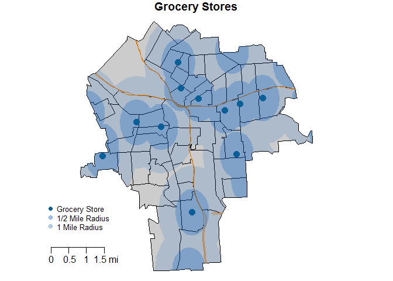
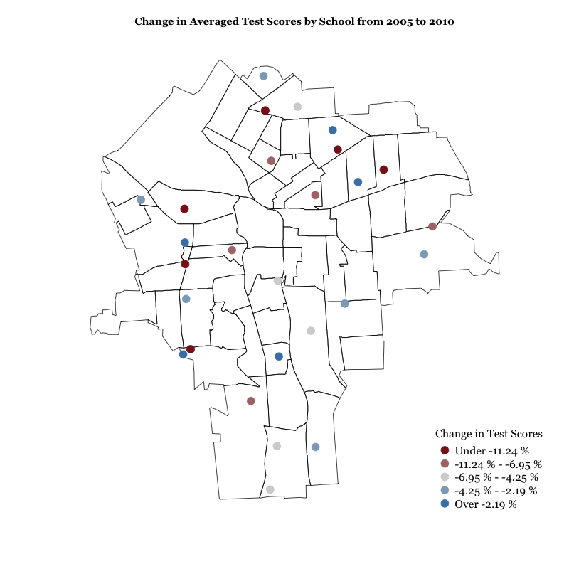
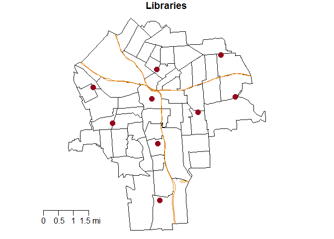
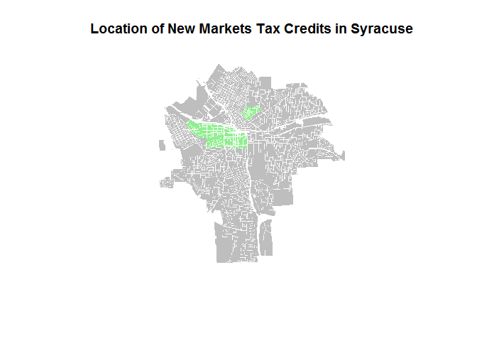
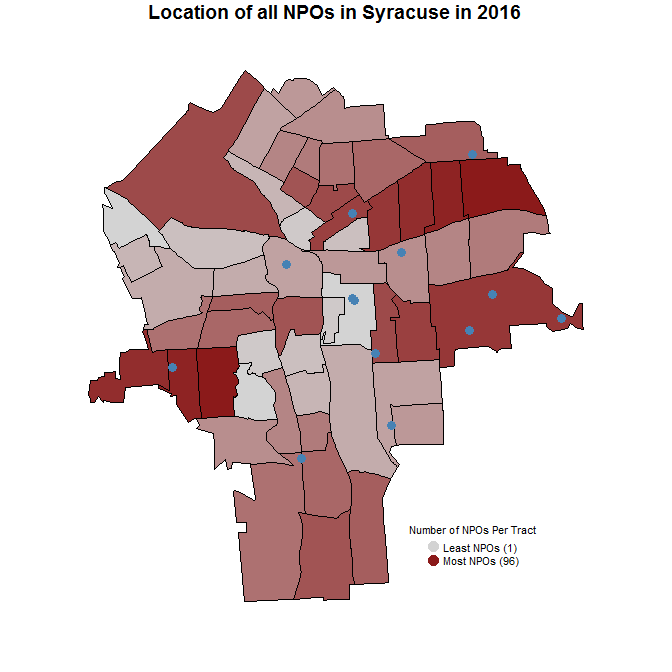
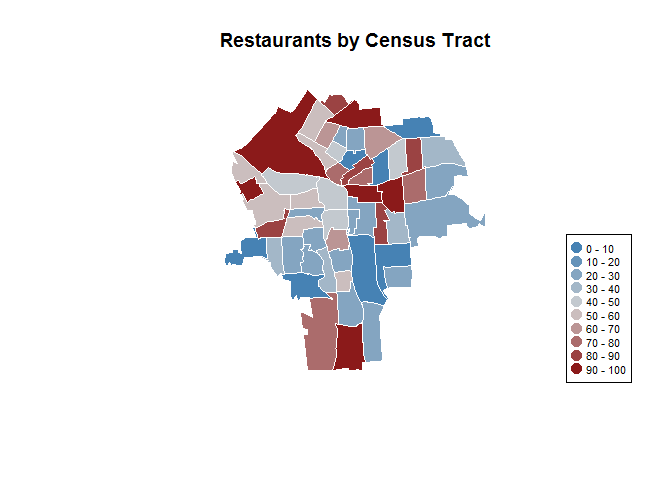
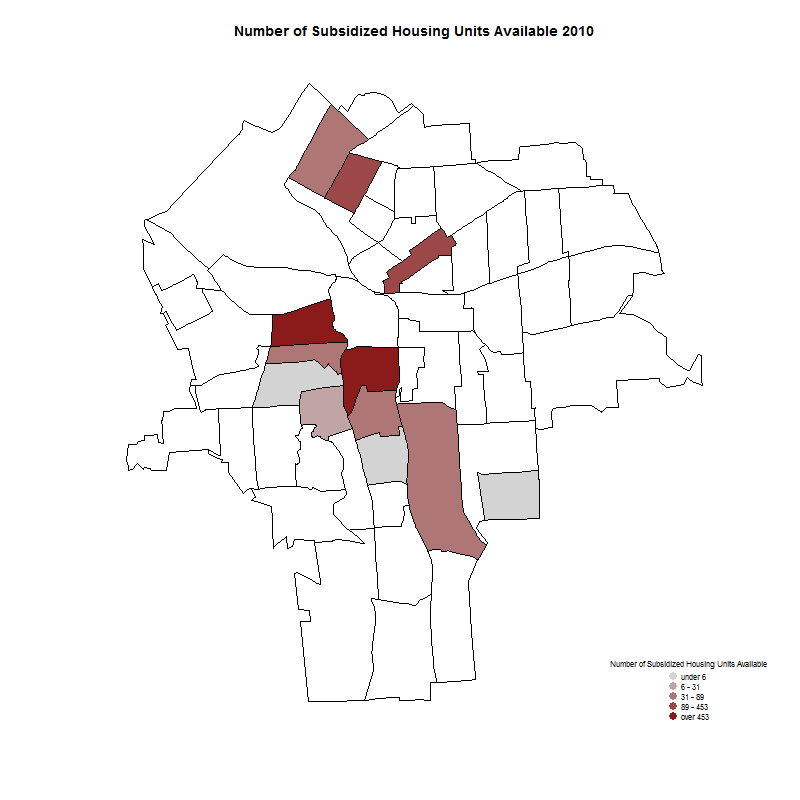
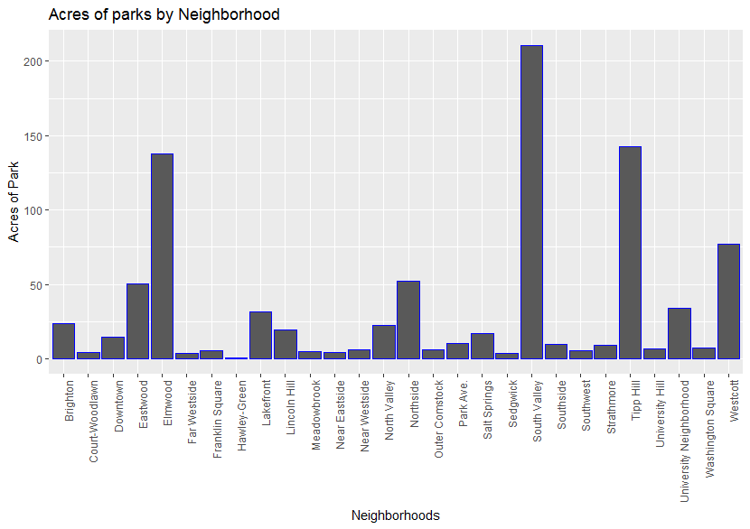
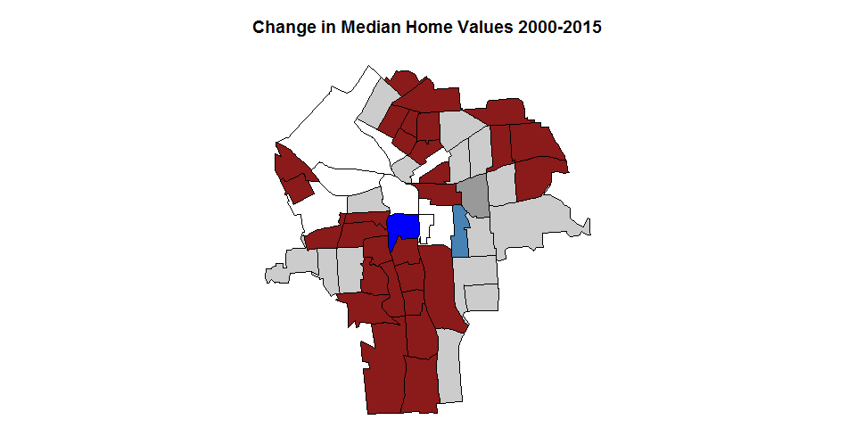

# Evaluating Determinants of Land Value

## Project Overview

The following analysis aims to explore potential drivers of property value change over time in the city of Syracuse. A range of factors that are likely correlated to this change were explored, including: demographic trends, the location of amenities, the existence of economic development programs, and indicators of neighborhood health. The choice of these variables was informed by a literature review which can be found under “Literature Review.” 

The data for analysis was extracted from different online sources including: The Department of Housing and Urban Development, the City of Syracuse, the Good Jobs First Center, Syracuse University's Geography Department, and Yelp. To the best of our knowledge, the information contained here is accurate and reliable as of the date of publication. 

Key visualizations of trends in each of the analyzed factors can be found in the links below under “Building the Research Database.” These visualizations are intended to provide an instructive framework through which to think about how the city of Syracuse has been changing, evolving, and adapting over time. Source code and descriptions of how the data for each variable was obtained and processed is provided in these links as well.

Following the initial exploratory analysis, several regressions were run to determine the extent to which each factor explains variations in property values in the city of Syracuse. An in-depth review of these models can be found under “Results” below.

It is our hope that the data and visualizations presented here can be used in the future for additional analysis and to gain a better understanding of the dynamic elements of property value and neighborhood health in Syracuse. In pursuit of this goal, an outline of how the provided data can be used has also been provided in the “Using the Research Database” section below. 

## Review of the Academic Literature

We have conducted a literature review and outlined some of the key research in the field of land value. We have provided an outline of the key findings from this field of research, and links to the original articles included in this research repository.

You will find the outline here: [Literature Review](litreview.md)

## Building a Research Database

Each of the following pages presents an outline of the steps necessary to compile a single data source to build the research database, and the documentation and basic descriptive analysis of the source.

### [Grocery Stores](grocery.html)

This dataset contains the locations of grocery stores in 2015.

### [Schools](Schools.html)
This dataset contains test averages for all schools of the Syracuse City School District for years 2005, 2010, and 2015. The data is wrangled to provide a standardized score for each school and for each census tract for years 2005, 2010, and 2015.

### [Libraries](library.html)

This dataset contains the locations of Syracuse libraries in 2017.

 

### Permits

This dataset includes permits issued by the City of Syracuse. For better analysis, we have grouped the data in four large categories: 1) Residential Properties, 2) Commercial Properties, 3) Demolitions and 4) Installations and Repairs. Relevant variables of the data include: Type, value and location of permits. 

#### [Permits geocoding and formating process](Permits_Wrangling.html)  
This is a description of the geocoding process and the formatting of the dataframes.

#### [Descriptives](Permits_Descriptive_Statistics.html)
This files shows some descriptive statistics of permits in the City of Syracuse.

 

### [Low-Income Housing Tax Credits](lihtc_data.html)

This dataset contains the number and location of Low-Income Housing Tax Credits in Syracuse from 2005 to 2015.

 

### [New Market Tax Credits](NMTC_data.html)  

This dataset contains the number and dollar amounts of New Markets Tax Credits in Syracuse from 2003 to 2014.

 

### [Fire and Police Stations](firepolice.html)

This dataset contains the locations of Syracuse fire and police stations in 2017.

 

### [Nonprofits](NPO_data.html)  

This dataset contains an overview of how to prepare data from the National Center for Charitable Statistics and filter it down to the Syracuse level. There are various iterations of the finalized output: the cumulative number of nonprofits across years, new nonprofits per year, and a breakdown of nonprofits by subsector.

 

### [Restaurants & Bars](Aggregate_Yelp_Data.html)
This dataset contains restaurant and bar information from establishments in the city of Syracuse.  The data was mined from Yelp and includes ratings, reviews, prices and numerous other attributes as of April 2017.  The distribution of establishments across the city, especially those of with higher ratings and prices, shows dramatic differences between neighborhoods north and south of Interstate 690 including pockets of high and low activity in both. 

 

### [Tax Subsidies](TaxSubsidies_SYR.html)
This dataset contains all local government tax breaks given to corporations in the City of Syracuse from 2003 to 2014. Our analysis uses information compiled by the Good Jobs First Center and includes tax breaks given by national, state and local government agencies.

 

### [Code Violations](Download_and_clean_code_violations.html)
This dataset contains information on frequency of code violations by census tract from 2012-2015.   

 

### [Public Housing](Download_and_Clean_Public_Housing_Data.html)
This dataset contains information on the number of subsidized housing units available by census tract from 2010-2015.   

 

### [Parks](park_data1.html)
This dataset contains parks information in the city of Syracuse.  The data was mineSyracuse University's Geography Department has the data of public space and parks. After having the data, it should be cleaned, geocoded, and aggregated in order to be included in the analysis of all variables collected for this project. Different parks have different affects for the community and the condition of the community also decide whether the park will increase property value or decrease by itself. So the following descriptive data will show park type and Nhood. This should test with community trends in crime(which is not availbale now) and poverty. (Further possible models could be NB, KSVM, SVM, lm. Using 2/3 data as train data and 1/3 for test data.)

 

### [Census Data](CensusData.html)

This file contains census data from the ACS from years 2011-2015 and from the 2000 and 2010 Dicennial Census. 42 variables are included related to housing, race, poverty, employment, vacancy, travel time to work, and more. 

<iframe src="https://chriswdavis.shinyapps.io/descriptives/" width = "100%" height = "900" scrolling = "no" frameborder = "0">
  
Your browser does not support iframes.

</iframe>

 
 

## Using the Research Database

### [Overview and Modification Guide](Using_the_Research_Database.html)

This page is intended to give a working overview of the research database and the type of data that is currently has available.  In addition, this page includes descriptions and code samples of the general process of building the research database such that it can be modified or extended in the future.

## Results

### [Analysis](Compile-Datasets.html)  

 

### Main Findings

## Conclusion

As shown in our analysis, we are presenting the Syracuse Land Bank with a flexible tool to explore the impact of a variety of policies and other factors on the city. 

First, it provides the basis to explore the relationships that exist between housing values and a variety of characteristics—ranging from code violations to the clustering of bars and restaurants to government tax breaks.  
 
Second, the project allows for the visualization of these determinants in the form of tables, maps and graphs so as to identify Syracuse-specific trends and to help inform and reinforce decisions made by the Syracuse Land Bank.  
 
Moreover, we present flexible code allowing for a reproducible data process. For each variable, we provide the original data source and step-by-step instructions of the data wrangling process with the objective that updated data can be incorporated and wrangled for future needs. Similarly, we aim to facilitate an easily reproducible process for producing visualizations and descriptive statistics.
 
We are hopeful that this project will provide the Land Bank with a strong foundation to examine the many factors that affect housing values and can be expanded upon to better inform the Land Bank’s decision-making process in the future.

## Acknowledgements

This project was made possible through the hard work of the following MPA students:

Alejandro Alfaro Aco <aalfaroa@syr.edu>,  
Christine Elise Brown <cbrown09@syr.edu>,  
Christopher Davis <cdavis10@syr.edu>,  
Cristian Ernesto Nuno <cenuno@syr.edu>,  
Francisco Javier Santamarina <fjsantam@syr.edu>,  
Ignacio Carlos Pezo Salazar <ipezosal@syr.edu>,  
Jonathan Beeler <jfbeeler@syr.edu>,  
Kyle Robert Crichton <krcricht@syr.edu>,  
Linnea Powell <lipowell@syr.edu>,  
Mengran Gao <mgao05@syr.edu>,  
Stephanie Stevenson Wilcoxen <sswilcox@syr.edu>  

